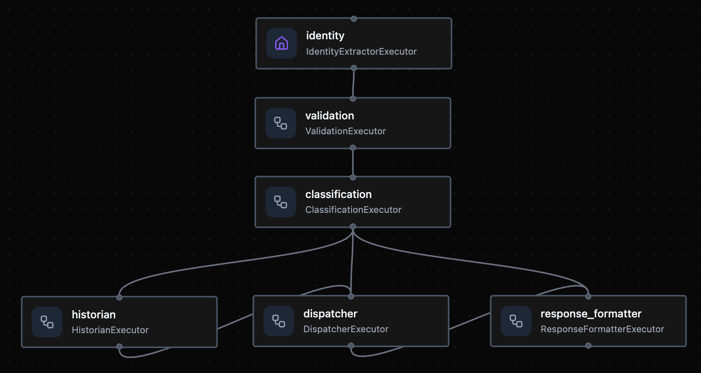
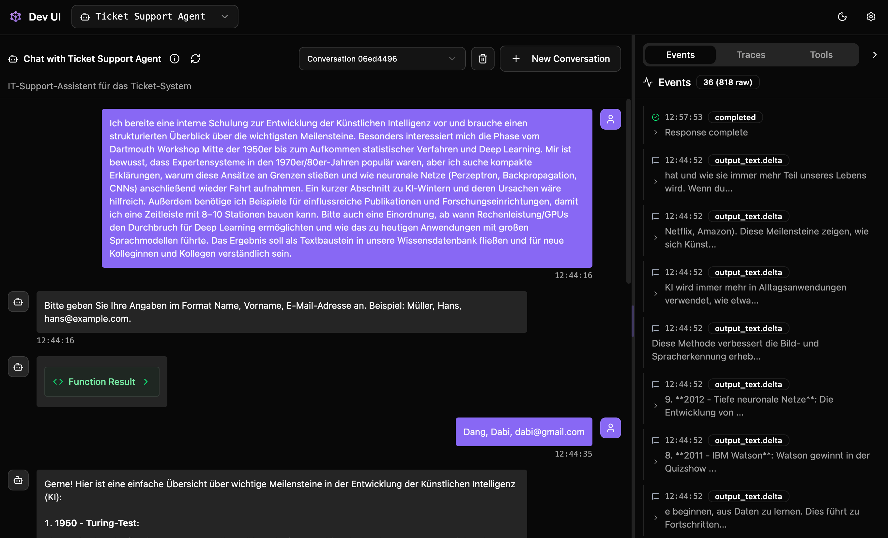
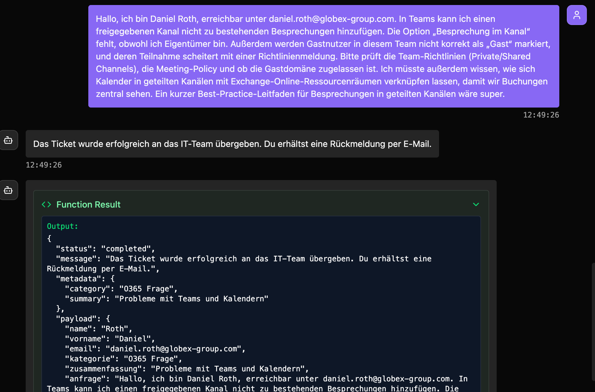

# Ticket Agent System

Showcase of a Microsoft Agent Framework workflow that turns free-form German IT helpdesk messages into routed tickets. The system combines Azure OpenAI reasoning, identity extraction, category-specific handling, and Logic App dispatch—all while remaining fully local-dev friendly.

## Features
- Branching Microsoft Agent Framework sequential workflow purpose-built for ticket intake and routing
- Dev UI conversational agent that mirrors production behavior (identity loops, streamed steps)
- Deterministic guardrails: strict identity enforcement, thread-aware state, and metadata-rich responses
- Production-style integrations (Azure OpenAI, Logic Apps) with enforced dispatch simulation for local/dev scenarios
- FastAPI entry point for automation and downstream integrations, backed by regression tests and sample cases

## Agent Lineup & Responsibilities


_**Overview of Agent Coordination in DevUI**_

| Agent | Purpose | Key Skills |
| --- | --- | --- |
| `IdentityExtractorExecutor` | Entry point that normalizes input, keeps the original request, and extracts `Name`, `Vorname`, `E-Mail` via Azure OpenAI plus regex fallback. | Intake + extraction, LLM parsing |
| `ValidationExecutor` | Halts the workflow until all identity fields are present, returning a single strict format request for the Dev UI to relay. | Guardrails, UX loops |
| `ClassificationExecutor` | Categorizes the ticket into five buckets, emits a ≤9-word summary, and produces a cleaned request body for downstream consumers. | LLM reasoning, content structuring |
| `HistorianExecutor` | Generates concise German answers when the ticket is “Frage zur Historie von AI,” feeding the dispatcher/formatter pipeline. | Domain-specific response crafting |
| `DispatcherExecutor` | Builds the structured payload and (optionally) posts it to the Logic App; simulation mode mirrors the final success text. | Integrations, HTTP |
| `ResponseFormatterExecutor` | Consolidates the final human response plus lightweight metadata/payloads; short-circuits OTHER tickets with an `unsupported` status. | Presentation, metadata packaging |

## Workflow at a Glance
1. **User submits raw text only.** No forms—just paste the full request.
2. **Agents collaborate via branching workflow.** Each executor mutates a shared `TicketContext` dataclass, and the Microsoft Agent Framework switch-case routes requests after classification.
3. **Identity-first guardrails.** Missing attributes trigger a friendly clarification message; clients re-run with the required fields.
4. **Branching after classification.** The workflow branches into three paths based on category:
   - **AI_HISTORY**: classification → historian (generates answer) → dispatcher → formatter
   - **O365/HARDWARE/LOGIN**: classification → dispatcher → formatter (skips historian)
   - **OTHER**: classification → formatter (early exit, skips both historian and dispatcher)
5. **Consistent responses.** The formatter returns the answer, classification, dispatch status, and structured payload so any client (Dev UI, API, tests) can display the same result.

### Identity & Conversation Guardrails
- Follow-up identity inputs must use the strict format `Name, Vorname, E-Mail-Adresse` (e.g., `Schneider, Peter, peter@example.com`).
- Conversation state is tracked per `thread_id`. When the system is waiting for identity, new non-identity queries are rejected until the client supplies the required format.
- Identity provided via follow-up messages is merged with the preserved original ticket body; classification only sees the original request.
- Dispatcher simulation is forced in Dev UI and API flows to keep Logic App traffic deterministic unless `--enable-dispatch` is explicitly passed to the Dev UI launcher.

## Getting Started
1. Install [uv](https://docs.astral.sh/uv/).
2. Copy `.env.example` to `.env`, set Azure OpenAI + Logic App values.
3. Install dependencies: `uv sync --prerelease=allow`.

### Local Development (DevUI)

**⚠️ DevUI is for LOCAL DEVELOPMENT ONLY, not production!**


_**Ticket Workflow registered in the DevUI inspector with each agent step visible.**_


_**Conversational Ticket Support Agent calling the workflow behind the scenes and requesting missing identity info.**_


_**DevUI logs and function-call traces that make debugging and payload inspection easier.**_

```bash
uv run --prerelease=allow chat-agents-system-devui --auto-open
```
- Registers the "Ticket Workflow" inside the Microsoft Agent Framework Dev UI.
- Lets reviewers inspect each agent step, streamed responses, and dispatcher payloads.
- By default, dispatch is simulated (no actual POST requests are sent). Use `--enable-dispatch` to send real requests to the Logic App.

### Production API (FastAPI)

```bash
# Run production API server
uv run --prerelease=allow chat-agents-system-api

# Or with custom port
uv run --prerelease=allow chat-agents-system-api --port 8000
```

- Production-ready REST API at `http://localhost:8000`
- Interactive API docs at `http://localhost:8000/docs`
- Health check at `http://localhost:8000/health`
- Dispatcher runs in simulation mode by default; multi-worker deployments are intentionally avoided because the workflow keeps conversation state in-process (single worker recommended).
- Identity follow-ups must include `thread_id` so the state tracker can join them with the original request.

### Sample Cases (scripted demo)
```bash
uv run --prerelease=allow python scripts/run_sample_cases.py
```
Runs representative prompts (all categories plus identity edge cases) with dispatch simulation—ideal for regression tests or CI.

### Automated Tests
- `tests/test_api_tickets.py` uses FastAPI's `TestClient` to cover missing-identity loops, strict identity enforcement, `thread_id` validation, and successful ticket creation.
- Tests stub Azure OpenAI and Logic App calls, keeping runs deterministic and cost-free.

## Common Tasks
- **Run it locally** – DevUI + FastAPI quick start at [docs/run-local.md](docs/run-local.md).
- **Use Docker** – container parity, hot reload, and image builds at [docs/run-docker.md](docs/run-docker.md).
- **Run tests / CI** – smoke tests, pytest coverage, and pipeline tips at [docs/testing-ci.md](docs/testing-ci.md).
- **Provision infra & deploy** – Terraform + Azure Container Apps walkthrough at [docs/cloud-deploy.md](docs/cloud-deploy.md).
- **Hook up clients & extend** – frontend integration patterns and roadmap ideas at [docs/extensions.md](docs/extensions.md).

## Tech Stack
- **Agent framework:** Microsoft Agent Framework with branching sequential workflows + DevUI integration
- **API surface:** FastAPI + Uvicorn for the production server and health/docs endpoints
- **LLM services:** Azure OpenAI Chat (GPT-4o-mini on Microsoft Foundry) for identity extraction, classification, and historian answers
- **Runtime & packaging:** `uv` for dependency management and scripts, backed by Poetry-style lock files
- **Integrations:** Azure Logic Apps webhook dispatch (simulation-first), optional Logic App postings in prod
- **Language & tooling:** Python 3.11+, pytest for tests, Docker for local parity, Terraform + Azure Container Apps for deployment

## Project Structure
```
src/chat_agents_system/
├─ agents/
│  ├─ classification.py
│  ├─ dispatcher.py
│  ├─ historian.py
│  ├─ identity.py
│  ├─ response_formatter.py
│  └─ validation.py
├─ api/
│  ├─ main.py
│  └─ routes/
│     ├─ health.py
│     └─ tickets.py
├─ workflow.py             # Branching workflow wiring each agent with switch-case routing
├─ devui_app.py            # Dev UI server (LOCAL DEVELOPMENT ONLY)
├─ api_server.py           # Production API server entry point
├─ schemas.py              # TicketContext + response dataclasses
├─ config.py               # Environment-driven settings (Azure OpenAI, Logic App, defaults)
└─ utils.py                # Shared helpers (logger factory, JSON parsing, etc.)
```

## Deployment

### Docker

- DevUI vs API containers, hot reload overlay, and production image guidance: [docs/run-docker.md](docs/run-docker.md)

### Azure Container Apps

- Deploy to Azure Container Apps for serverless container hosting with automatic scaling: [docs/cloud-deploy.md](docs/cloud-deploy.md)

### Frontend Integration

- Connect your frontend to the production API and handle identity loops correctly: [docs/extensions.md#1-frontend-integration](docs/extensions.md#1-frontend-integration)

## Extension Ideas

See `docs/extensions.md#2-extension-ideas` for additional enhancement ideas:
- Observability & monitoring
- State management & persistence
- CI/CD pipelines
- Multi-channel intake
- Enhanced agent capabilities

Use this repo to demonstrate real-world agent orchestration, integration-ready prompts, and a complete ticketing pipeline. 

