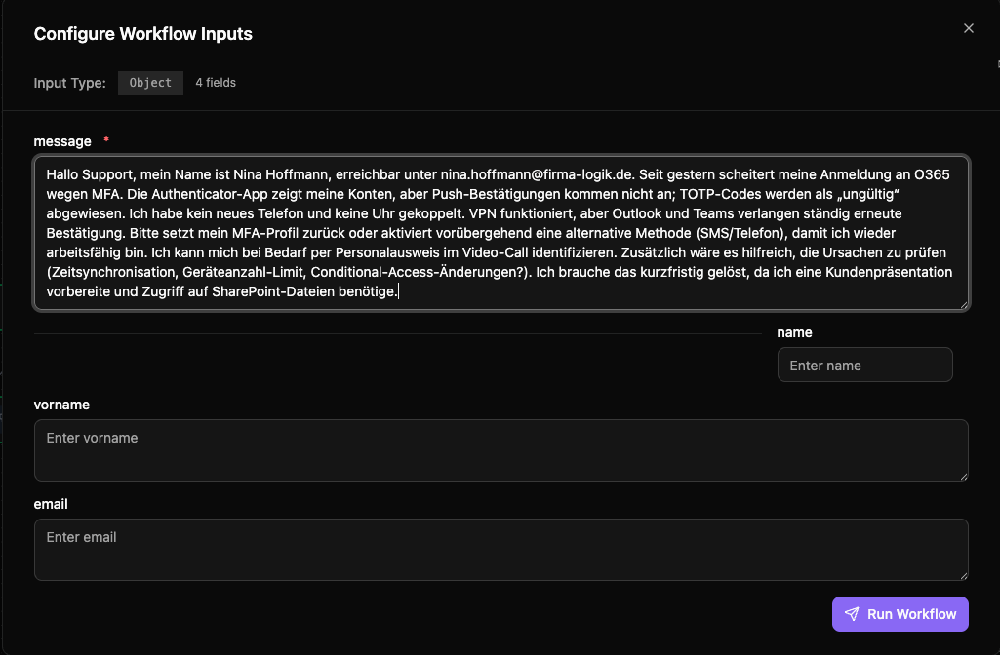

# Obungi Ticket Agent System

Showcase of a Microsoft Agent Framework workflow that turns free-form German IT helpdesk messages into routed tickets. The system combines Azure OpenAI reasoning, identity extraction, category-specific handling, and Logic App dispatch—all while remaining fully local-dev friendly.

## Features
- Multi-agent workflow purpose-built for ticket intake and routing
- Dual entry points: conversational CLI and Microsoft Agent Framework Dev UI
- Strong focus on identity validation, guardrails, and deterministic dispatching
- Production-style integrations (Azure OpenAI, Logic Apps) with simulation switches for demos

## Agent Lineup & Responsibilities
| Agent | Purpose | Key Skills |
| --- | --- | --- |
| `IntakeExecutor` | Normalizes raw user text, trims whitespace, captures quick heuristics. | Text preprocessing, regex extraction |
| `IdentityExtractorExecutor` | Azure OpenAI-powered extraction of `Name`, `Vorname`, `E-Mail`. Falls back to regex and requests clarification via metadata. | LLM parsing, resilience |
| `ValidationExecutor` | Blocks the workflow until mandatory identity fields exist; returns actionable prompts for the CLI/Dev UI. | Guardrails, UX loops |
| `ClassificationExecutor` | Classifies into five categories, creates a 10-word summary, and rewrites the request body for clean downstream payloads. | LLM reasoning, content structuring |
| `HistorianExecutor` | Generates concise German answers whenever the ticket is “Frage zur Historie von AI.” | Domain-specific response crafting |
| `DispatcherExecutor` | Posts the normalized ticket JSON to an Azure Logic App (simulatable via a flag). | Integrations, HTTP |
| `ResponseFormatterExecutor` | Finalizes the human-facing response plus machine-readable metadata for clients. | Presentation, metadata packaging |

## Workflow at a Glance
1. **User submits raw text only.** No forms—just paste the full request.
2. **Agents collaborate sequentially.** Each executor enriches a shared `TicketContext` dataclass.
3. **Identity-first guardrails.** Missing attributes trigger a friendly clarification message; clients re-run with the required fields.
4. **Category-specific handling.** Historian tickets get an answer plus a Logic App dispatch; other categories are routed immediately.
5. **Consistent responses.** The formatter returns the answer, classification, and dispatch payload so any client (CLI, Dev UI, tests) can display the same result.

## Getting Started
1. Install [uv](https://docs.astral.sh/uv/).
2. Copy `.env.example` to `.env`, set Azure OpenAI + Logic App values.
3. Install dependencies: `uv sync --prerelease=allow`.

### Run the CLI (local conversation)
```
uv run --prerelease=allow obungi-chat-agents-system
```
- Compose your request line by line; blank lines are preserved.
- Press `STRG+ENTER` to submit instantly (or type `:done` / `:send` as a fallback). Helpful commands:
  - `:preview` shows the current text inside a panel.
  - `:clear` wipes the buffer so you can start over.
  - `:help` lists all commands (including `::` escaping for literal colons).
- Watch live agent status updates (intake → identity → validation → classification → dispatch).
- Missing identity fields are called out explicitly; supply only what’s missing and continue.
- After the final response, the CLI immediately prompts for the next ticket.

### Run the Dev UI (browser showcase)




```
uv run --prerelease=allow obungi-chat-agents-system-devui --auto-open --simulate-dispatch
```
- Registers the “Ticket Workflow” inside the Microsoft Agent Framework Dev UI.
- Lets reviewers inspect each agent step, streamed responses, and dispatcher payloads.
- `--simulate-dispatch` keeps demos safe by bypassing the actual Logic App.

### Sample Cases (scripted demo)
```
uv run --prerelease=allow python scripts/run_sample_cases.py
```
Runs representative prompts (all categories plus identity edge cases) with dispatch simulation—ideal for regression tests or CI.

## Tech Stack
- **Framework:** Microsoft Agent Framework (planner-free sequential workflow)
- **LLM:** Azure OpenAI Chat (classification, historian, identity reasoning)
- **Runtime:** `uv` for dependency + script management
- **Integrations:** Azure Logic Apps (JSON webhook dispatch)
- **Language:** Python 3.11+

## Project Structure
```
src/obungi_chat_agents_system/
├─ agents/                 # Individual executors (intake, identity, validation, etc.)
├─ workflow.py             # Sequential workflow wiring each agent
├─ devui_app.py            # Dev UI server entry point
├─ cli.py                  # CLI entry point (via uv script)
└─ schemas.py              # TicketContext + response dataclasses
```

## Extension Ideas
- **Docker & cloud-ready deployment:** Bake the CLI + Dev UI into a single container for reproducible demos or AKS hosting.
- **Rich web frontend:** Replace the Dev UI with a branded Next.js/shadcn dashboard that surfaces each agent step, streaming output, and retry controls.
- **Ticket telemetry & analytics:** Persist dispatcher payloads to a database and ship Grafana-style dashboards showing categories, SLA compliance, agent turnaround time, and Logic App performance.
- **Multi-channel intake:** Add Teams/Slack bots or email ingestion that push tickets into the same workflow schema.
- **Knowledge-aware responses:** Plug in RAG or SharePoint search to help Historian answers cite source documents.
- **Agentic orchestration patterns:** Experiment with planner-driven, branching, or concurrent workflows for complex tickets, or swap in review/critic loops to keep responses aligned with compliance requirements.

Use this repo to demonstrate real-world agent orchestration, integration-ready prompts, and a complete ticketing pipeline. 

